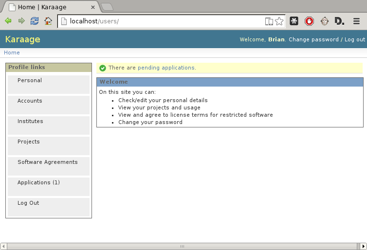

Specific Requirements
=====================
This section contains all of the functional and quality requirements of the
system. It gives a detailed description of the system and all its features.

External interface requirements
-------------------------------
This section provides a detailed description of all inputs into and outputs
from the system.

User Interface
~~~~~~~~~~~~~~
Karaage is web based, so it is expected most :term:`users` will access it via a
web browser loaded on their computer.

The user interface should be easy, simple, and obvious to use for
all target users of Karaage, as per :ref:`user_characteristics`.

   Karaage, as seen by a person.

Software Interfaces
~~~~~~~~~~~~~~~~~~~
Karaage needs access to external :term:`data stores`, which at present time
consists one/more of:

*   OpenLDAP
*   Directory Server/389
*   Slurm
*   Gold

.. todo:

    *   Active Directory

Other data stores to be provided by third party software, e.g. karaage-keystore.

An API is required for use by submission scripts used by the PBS software, to
retrieve information required for the submission. This API is only required if
PBS software is used.

An API is also required to submit :term:`super computer` usage information,
if required by :term:`local requirements`.

Upload usage data requirements
""""""""""""""""""""""""""""""
The following RPC procedures are defined, which can be called remotely. XMLRPC
is the mechanism used for RPC procedure calls.

..  py:function:: parse_usage(machine_name, password, usage, date, machine_name2, log_type)

    :param str machine_name: Authenticate as this machine.
    :param str password: Machine's password.
    :param array usage: Log file to process.
    :param str date: Date log file was captured.
    :param str machine_name2: Legacy; must match machine_name.
    :param str log_type: Format of log file.
    :return: (summary, output)
    :rtype: tuple

    Process usage log and add/replace data in Karaage database.

PBS RPC requirements
""""""""""""""""""""
The following RPC procedures are defined, which can be called remotely. XMLRPC
is the mechanism used for RPC procedure calls.

..  note:

    No authentication is to be used unless password is supplied to function.

..  py:function:: get_disk_quota(username, machine_name=None)

    :param str username: Account username to get quota for.
    :param str machine_name: Machine to get quota for.
    :return: Disk quota in KB.
    :rtype: int

    Get the account disk quota for the person, in KB.

..  py:function:: get_project_members(machine, password, pid)

    :param str machine_name: Authenticate as this machine.
    :param str password: Machine's password.
    :param str pid: Project PID to get members for.
    :return: 
        A list of usernames in a given project id.

        If an error occurs, return a str representing the error instead.
    :rtype: list

    Get list of members in a project.

..  py:function:: get_projects(machine, password)

    :param str machine_name: Authenticate as this machine.
    :param str password: Machine's password.
    :return: A list of project PIDs for the machine.
    :rtype: list

    Get list of projects available for the machine.

..  py:function:: get_project(username, pid, machine_name=None)

    :param str username: Username submitting job.
    :param str pid: Requested project PID.
    :param str machine_name: machine name that job is being submited on.

        Optional for legacy reasons, it should always be
        supplied in current code.
    :return: project pid found, or the str "None" if this failed.
    :rtype: str

    Tries to identify the most suitable project for this job, or the str
    "None" if this failed.

    Used in the submit filter to make sure user is in project.

..  py:function:: get_users_projects(username, password)

    :param str username: Authenticate as this person.
    :param str password: Person's password.
    :return: A tuple (0, list(pid, pid, ...))
    :rtype: tuple

    Get list of projects person is in.

..  py:function:: project_under_quota(pid, machine_name=None):

    :param str pid: Requested project PID.
    :param str machine_name: machine name being checked.

        Optional for legacy reasons, it should always be
        supplied in current code.
    :return: ``True`` if project is under quota, otherwise ``False``.
    :rtype: bool

    Is this project under its usage quota?

..  py:function:: showquota(username, machine_name=None)

    :param str usernmame: Username of account being checked.
    :param str machine_name: machine name being checked.

        Optional for legacy reasons, it should always be
        supplied in current code.
    :return: a list of tuples (project_id, actual_mpots, quota_mpots)
    :rtype: list

    Retrieve the usage quota for the person on this machine.

Functional requirements
-----------------------
This section includes the requirements that specify all the fundamental actions
of the software system.

Access control
~~~~~~~~~~~~~~
This section includes all requirements that specify access control measures.

.. _roles:

Role requirements
"""""""""""""""""
Users can use Karaage as different roles. The following roles are
defined:

*   :term:`Unauthenticated users`
*   :term:`People`
*   :term:`Project leaders`
*   :term:`Institute delegates`
*   :term:`Administrators`

Note that Project leaders, Institute delegates, and Administrators are also
people.

Different roles have access to different sets of functions.

Unauthenticated users
"""""""""""""""""""""
Users are in the :term:`unauthenticated users` role if they access
Karaage without logging in. These users can:

*   Apply for an account
*   Login

People
""""""
Users are in the :term:`people` role if they access Karaage and log in. These
users can:

*   View details for own person.
*   View details for people in own projects.
*   View details for projects they belong to.
*   View details for machines and machine categories.
*   View details for software.
*   View usage information (optional).
*   Agree to licensed software.
*   Apply for restricted software.
*   Modify their own person.
*   Change password.
*   Reset password.
*   Logout

Project leaders
"""""""""""""""
Users are in the :term:`project leaders` role if they access Karaage and log in as
a person, *and they are marked as a leader for a project*. These
users can:

*   View details for people in project they lead.
*   View details for projects that they lead
*   Approve/Decline applications to join their project.
*   Reset passwords for their members.
*   Track their resource utilisation and software utilisation.
*   Edit project (restricted set of fields).

Institute delegates
"""""""""""""""""""
Users are in the :term:`institute delegates` role if they access Karaage and
log in as a person, *and they are marked as a delagate for an institute*. These
users can:

*   View details for people in institute they delegate.
*   View details for people in project for institute they delegate.
*   View details for projects for institute they delegate.
*   View details for institutes they delegate.
*   Approve/Decline project applications.
*   Manage all projects and users under the institute.

Administrators
""""""""""""""
Users are in the :term:`administrators` role if they access Karaage and log in
as a administrator, *and they are marked as an administrator*. These users can
be denied administration access if configured by website. These users can:

*   View/edit details for people.
*   View/edit details for projects.
*   View/edit details for institutes.
*   View/edit details for machine and machine categories.
*   View/edit details for software.
*   View usage information.
*   Change passwords for any person.
*   Creating/delete/reactivate people [#delperson]_.
*   Creating/delete accounts [#delaccount]_.
*   Creating/delete projects.
*   Creating/delete institutes.
*   Approve/Decline project applications.
*   Approve/Decline software applications.
*   Lock/unlock people.
*   Make person as bounced email.
*   View logs/comments for any object.
*   Add comments to any object.
*   View low level (verbose) information from data stores.

.. _additional_access_people:

Additional requirements for people
""""""""""""""""""""""""""""""""""
Having access to view details for a :term:`person` implies being able to:

*   Send email allowing person to reset their passwords
*   View list of all projects person leads.
*   View list of all projects person belongs to.
*   View list of all software agreements.
*   View list of all accounts for person.
*   View list of all jobs for person.

.. _additional_access_projects:

Additional requirements for projects
""""""""""""""""""""""""""""""""""""
Having access to view details for a :term:`project` implies being able to:

*   View project caps/quota for project.
*   View list of members of project.
*   View list of projects in institute.

.. _additional_access_institutes:

Additional requirements for institutes
""""""""""""""""""""""""""""""""""""""
Having access to view details for a :term:`institute` implies being able to:

*   View project caps/quota for institute.
*   View list of members of institute.
*   View the institute users information for the institute.

Project Applications
~~~~~~~~~~~~~~~~~~~~
This section specifies the requirements for project applications

Project applications are to be disabled by default.

Request by unauthenticated
""""""""""""""""""""""""""
For :term:`unauthenticated users`, an email address is required. An email is
sent to that address with a link containing a random value. The user can click
on this link and continue with the application.

Request by person
"""""""""""""""""
For :term:`people`, no extra information is required, and the application
process will start immediately. An email is sent to the registered email
address of the person reminding them of the open application.

Unauthenticated user is existing person
"""""""""""""""""""""""""""""""""""""""
There is the risk that the unauthenticated user requesting a project actually
does have a :term:`person`. If the user enters an email address in use by a
person, then the application will get assigned to this person. The person will
have to log in to continue. If the users enters an email address that is
different from anything in the system, they could try to register an user name
of their existing person, which will get denied, because it is already in use.
Or they will pick another user name, and get two completely different person.

To mitigate this possibility, any of the people who can access the application
can make the user as a duplicate user, which flags it from system
administrators, who can then reassign the application to the person and restart
the process.

Logged in person accesses wrong application
"""""""""""""""""""""""""""""""""""""""""""
The other corner case is what happens if an person accesses the randomly
generated link meant for an unauthenticated user and/or another person. This
would generally mean that the unauthenticated user has an person already. As a
result, the user is given an option to take over the application, or log out to
access it as the unauthenticated user.

This is particularly useful for the Shibboleth step. The shibboleth step
involves the user logging into to Shibboleth. Normally, this wouldn't log the
user into Karaage, as they don't have a person yet. If the user is logged in
automatically, this means the person already does have a person, and they
are given an option to take over the application.

Actions
"""""""

For a request to join a project (approved by project leader) or
to create a new project (approved by institute delegate):

.. actdiag::

   actdiag {
      REQ -> EMAIL -> AED -> SUBMIT
      -> AEMAIL -> A
      -> KEMAIL -> SITE -> K
      -> WAIT -> PASSWORD;

      lane {
         label = "Unauthenticated /
         Person"
         REQ [label="Request application"];
         EMAIL [label="Receive E-Mail"];
         AED [label="Enter details"];
         SUBMIT [label="Submit"];
         WAIT [label="Wait for approval"];
         PASSWORD [label="Enter password"];
      }
      lane {
         label = "Project Leader /
         Institute Delegate"
         AEMAIL [label="Receive E-Mail"];
         A [label="Approve"];
      }
      lane {
         label = "Administrator"
         KEMAIL [label="Receive E-Mail"];
         SITE [label="Site specific tasks"];
         K [label="Approve"];
      }
   }

.. note::

    The first email step is only required when unauthenticated users start
    applications.  When authenticated users start applications, this step can
    be skipped.

.. note::

    The password step is only required when new :term:`person` is required.  If
    a new :term:`account` is required then the password for the :term:`person`
    can be requested and used for the account. If no new :term:`person` or
    :term:`account` is required, then this step can be skipped.

Software applications
~~~~~~~~~~~~~~~~~~~~~
This section specifies the requirements for software applications

Software applications only apply to restricted software. All non-restricted
software is automatically approved when the user agrees to the license.

Only people can access software applications.

For a request to join a project that is restricted:

Actions
"""""""
.. actdiag::

   actdiag {
      REQ -> SUBMIT
      -> A
      -> WAIT

      lane {
         label = "Person"
         REQ [label="Request application"];
         SUBMIT [label="Agree"];
         WAIT [label="Wait for approval"];
      }
      lane {
         label = "Administrator"
         A [label="Approve"];
      }
   }

Customization requirements
--------------------------
This section includes the design requirements to ensure it is possible
to customize Karaage for :term:`local requirements`.

It must be possible to install Karaage at different sites. It should be
possible to customize every site to match their own :term:`local requirements`,
as long as it falls under the defined scope of Karaage, as per this
specification. It should be possible to to do this customization using well
defined mechanisms that do not break with minor releases of Karaage, or have a
well defined upgrade path for major releases of Karaage.

.. _performance_requirements:

Performance requirements
------------------------
The requirements in this section provide a detailed specification of the user
interaction with the software and measurements placed on the system
performance.

Design constraints
------------------
This section includes the design constraints on the software caused by the
hardware.

As Karaage is a software project, this is outside the scope, and needs to be
set in a project plan for installing Karaage at a particular site.

Any reliable computer that meets the :ref:`operating_system_dependancies` and
can function as a web server that meets the :ref:`performance_requirements`
should be suitable for use with Karaage.

Software System attributes
--------------------------
The requirements in this section specify the required reliability,
availability, security and maintainability of the software system.

As Karaage is a software project, this is outside the scope, and needs to be
set in a project plan for installing Karaage at a particular site.

..  rubric:: Footnotes

..  [#delperson] People are never deleted, rather the db entry is marked
    as deleted. This is to ensure usernames are never recycled.

..  [#delaccount] Accounts are never deleted, rather the db entry is marked
    as deleted. This is to ensure usernames are never recycled.
